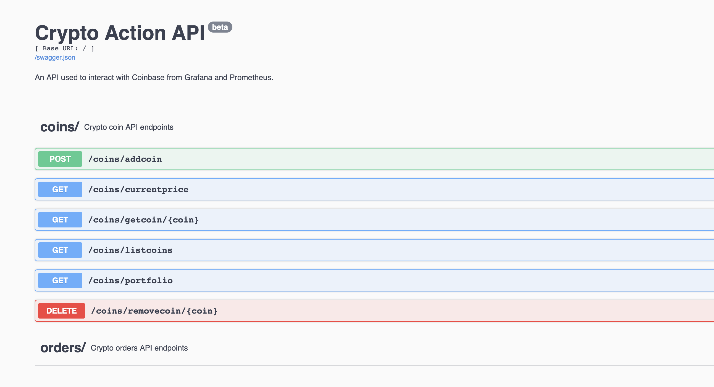

# CoinbaseConnector

## Overview

The collector sits between Coinbase and your Grafana+Prometheus deployment. Setting up Prometheus and Grafana are outside of the scope of this document. 

**Grafana** - Used for visualization and sending webhook alerts to the connector.

**Prometheus** - Scrapes the metrics(prices) from the connector.

**Connector** - Pulls the priceing and other metrics for the valid coins defined in the database. Also acts as a buy/sell API that can be queried when price targets are reached. The API endpoints can also be used with other forms of automation.

**Coinbase** - Current crypto brokerage platform.


## Setup

**Tools used**

Coinbase API

Docker

Python Promeheus v0.17.1

**Build**

Build the container with the *build_container.sh*

**Environment variables**

```bash
TIMESERVER='pool.ntp.org'
COINBASE_INTERVAL=10
DB_PATH='/db'
COINBASE_KEY=''
```

**Run the container**

```bash
docker run -d -p 9029:9029 -p 9030:9030 \
--mount type=bind,source="$(pwd)"/db,target=/db \
--mount type=bind,source="$(pwd)"/ssl,target=/etc/api/ssl \
-e APIVER='beta' \
-e COINBASE_INTERVAL=30 \
--network container_net \
--name coinbase_collector \
coinbase_collector:latest
```

**Database**

The SQLite DB is stored in the /db location in the container by default. To change it you will need to set the DB_PATH env varibale. 

## Prometheus

**Config**

```yaml
global:
  scrape_interval: 5s
  evaluation_interval: 5s
rule_files:
  - /etc/prometheus/prometheus.rules
alerting:
  alertmanagers:
  - scheme: http
    static_configs:
    - targets:
      - "alertmanager.monitoring.svc:9093"

scrape_configs:
  - job_name: 'CoinbaseConnector'
    metrics_path: /metrics
    static_configs:
      - targets: ['192.168.10.88:9029']
```

## Grafana Dashboard
Use the Grafana dashboard to visualize the collected data.

Get the dashboard [here](https://github.com/JonathanArrance/CoinbaseCollector/tree/main/dashboard)

## REST API

**Simple API connection**

The rest api can be found on port 9030. The Swagger doc can be use to test the api endpoints.

NOTE: Not all endpoints are implemented.

**Endpoints**

```
http://localhost:9030
```


